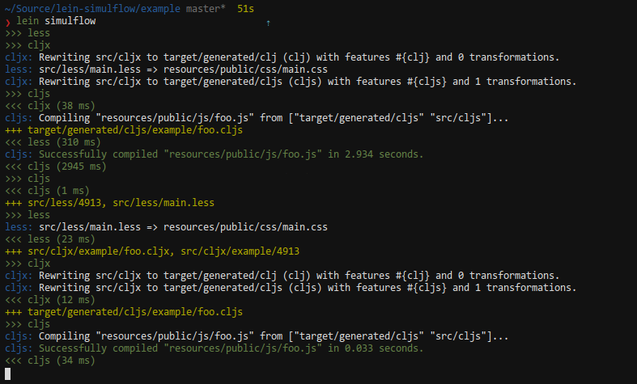

# lein-simulflow [](http://travis-ci.org/#!/metosin/lein-simulflow/builds)

Combine several lein auto tasks for leaner workflow.

*NOTE: Very early version, not usable*

```
“Daydreaming is the first awakening of what we call simulflow. It is
an essential tool of rational thought. With it you can clear the mind for
better thinking.”
```
– Frank Herbert, _Heretics of Dune_

## Usage

Check [example project.clj](./example/project.clj).

Put `[lein-simulflow "0.1.0-SNAPSHOT"]` into the `:plugins` vector of your
project.clj.

```bash
$ lein simulflow
```

## Overview

While doing modern project with both Clojure and ClojureScript your workflow
might require running several lein tasks parallel.
This means you would have to open several terminals and run tasks like following:

```bash
$ lein less auto # or gulp, compass, etc.
$ lein cljx auto
$ lein cljsbuild auto dev # or lein fighweel dev
$ lein midje :autotest
$ lein repl
```

Lein-simulflow will run your long running tasks in in one process so you'll only start two lein processes:

```bash
$ lein simulflow
$ lein repl
```



For notes about implementation and how this relates to other, similar,
plugins check [this](./doc/notes.md).

## Features

- Watch for file changes using Java 7 API (uses inotify or similar OS provded API)
  - Means also that not every plugin has to implement file watching again
- Tasks can depend on other tasks
  - Cljsbuild requires that Cljx has written the cljs sources
- Tasks run in parallel where possible
  - Eg. cljx and less
- Prepend output from tasks with the task name (by capturing *out*)
- Runs all tasks in one project JVM
  - Saves memory in comparison to running e.g. lein cljx and lein cljsbuild seperately

## TODO

- [ ] Test how well the `java.nio.file.WatchService` works for OS X
- [x] Instead of batching file events (which doesn't work here) try alternative approach:
  - For each main loop iteration: take all values from channel until timeout
- [x] Handle depenencies differently.
  - Start: cljs + cljx queued, cljx writes .cljs which queues cljs again...
  event though cljs is already queued -> cljs runs too many times.
- [x] Everything is slow. Cljs is not using incremental compiling etc. Plugin auto tasks have some state... Do something...

## NOTES

- Is the dependancy stuff useful for anything but the start up?
  - Conjure up some sequence diagrams...
- Is it a good idea to define output dirs for the tasks
  - Would it be simpler to just define from which other tasks the task depends?
- Might be this feature should be built into Leinigen and plugins would
implement some API to provide long running tasks.

## Contact

Ping `Deraen` on Freenode irc.

I would like to hear if you have thoughts about how to solve the problem
of many long running lein tasks, about this implementation or if you
think that that the problem is non-existent.
